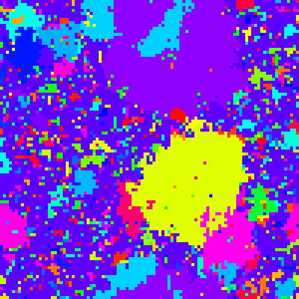

# :thought_balloon: Bornholdt

This is an implementation of a model introduced by [Bornholdt in 2011](todo)
for opinion dynamics.



It is implemented in Rust and will show an animation.

Just start it with `cargo`, (you can get it at, eg., [rustup.rs](https://rustup.rs/)):

```bash
cargo run --release
```

## :desktop_computer: Commandline options

* --simple: simulates the simple model
* --bornholdt: simulates Bornholdt's model
* --neighbor: neighbor variant
* --noise: variant with noise
* --alpha [value]: set the innovation rate
* --length [value]: set the side length of the grid
* --seed [value]: set the seed of the RNG

## :whale: Docker

If you are running Linux and have an X server installed (if you do not know what
this means, it is probably true; XWayland does also work), you can also use the provided docker container:

```bash
docker-compose build
# this is needed to allow access to your X-server from within the Docker container
xhost +local:
docker-compose up
```
